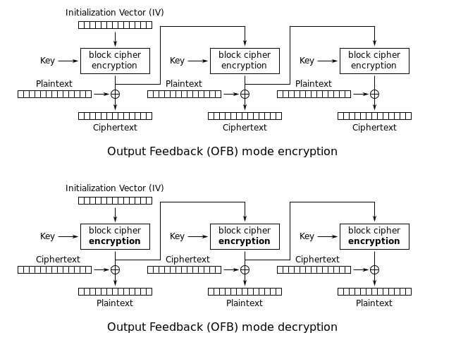

# 2017 Inc0gnito - [Crypto] des-ofb

## Key words

- DES-OFB
- Predict key, iv

## Solution 

문제는 일반적인 `OFB` 운영모드를 갖는 `DES`구조 입니다. 

```
#!/usr/bin/env python

import pyDes
from struct import pack, unpack

def xors(a, b):
    return pack('<Q', unpack('<Q', a)[0] ^ unpack('<Q', b)[0])

# pyDes do not support OFB mode
# so I have to implement myself T_T

class DES_OFB:
    def __init__(self, iv, key):
        self.iv = iv
        self.key = key
    def encrypt(self, data):
        data += '\x00' * (-len(data) % 8)
        ret = ''
        prev = self.iv
        for i in xrange(0, len(data), 8):
            blk = pyDes.des(self.key, pyDes.ECB).encrypt(prev)
            ret += xors(blk, data[i:i+8])
            prev = blk
        return ret

# I want to be sure that my precious file is not corrupted!!

legal = 'abcdefghijklmnopqrstuvwxyzABCDEFGHIJKLMNOPQRSTUVWXYZ{}_0123456789'

with open('flag', 'rb') as f:
    flag = f.read()
    for ch in flag:
        assert ch in legal

# iv and key are same as plaintext, but anyway it's secret
# so I think it's absolutely safe :p

k = DES_OFB(flag[:8], flag[:8])

with open('flag.enc', 'wb') as f:
    f.write(k.encrypt(flag))
```

`Xor` 연산이 대칭 연산이기 때문에 암복화 프로세스가 동일합니다.



문제에서 중요한것은 처음 `PlainText[:8]`을 `iv`와 `key`로 사용되었다는 점 입니다.

그렇다면 첫 8바이트는 다음과 같을 것 입니다.

```
iv  = pt[:8]
key = pt[:8]

ct[:8] = enc_des(key, ECB).encrypt(iv)
=> 7E 1F C5 5B 4B 62 1C A8 
```

여기서 한 가지 유추할 수 있는 부분은 대회 플래그 포멧이 `INC0{` 로 시작하기 때문에 처음 `iv`와 `key` 마지막 3바이트만 무작위 대입을 하여 암호화된 첫 5바이트가 `INC0{`로 복호화 되는 값을 찾으면 됩니다.

## Solution Code 

```python
#!/usr/bin/env python

import pyDes
from struct import pack, unpack

def xors(a, b):
    return pack('<Q', unpack('<Q', a)[0] ^ unpack('<Q', b)[0])

class DES_OFB:
    def __init__(self, iv, key):
        self.iv = iv
        self.key = key
    def encrypt(self, data):
        data += '\x00' * (-len(data) % 8)
        ret = ''
        prev = self.iv
        for i in xrange(0, len(data), 8):
            blk = pyDes.des(self.key, pyDes.ECB).encrypt(prev)
            ret += xors(blk, data[i:i+8])
            prev = blk

            if i == 0:
                if ret[0] != "I" or ret[1] != "N" or ret[2] != "C" or ret[3] != "0":
                    return False
        return ret

'''
7E 1F C5 5B 4B 62 1C A8   54 6E 4B 20 E3 88 03 40
A3 C5 81 78 7F 28 DA D3   A1 05 02 B8 FA 81 A1 5C
32 D7 04 74 43 60 24 91   07 E9 59 46 39 63 E4 FB
'''

legal = 'abcdefghijklmnopqrstuvwxyzABCDEFGHIJKLMNOPQRSTUVWXYZ{}_0123456789'

ct = open("flag.enc", "rb").read()

#   = "   I   N   C   0   {"
iv  = "\x49\x4e\x43\x30\x7b"
key = iv

table = "abcdefghijklmnopqrstuvwxyzABCDEFGHIJKLMNOPQRSTUVWXYZ0123456789_"

for i in table:
    print i
    for j in table:
        for k in table:
            tmp = iv + i + j + k
            obj = DES_OFB(tmp, tmp)
            res = obj.encrypt(ct)

            if res == False:
                continue

            try:
                res = res.decode("hex")
            except Exception as e:
                print str(e)
                print repr(res)

            if res[0] == "I" and res[1] == "N" and res[2] == "C" and res[3] == "0":
                print repr(res)
                exit()

# INC0{1t_wAs_jUSt_an_3A5Y_bf___I_was_stupid__T_T}
```
