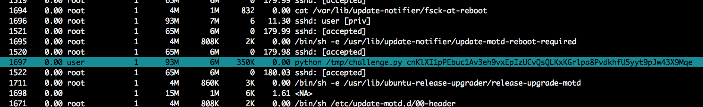
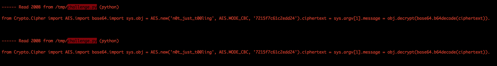

# 2017 SHA - [FORENSIC] Compromised?

## Key words

- scap
- sysdig

## Solution

원래 처음에 풀었던 방식은 `strings` 명령을 이용하여 일일이 조사하다가 발견했습니다.....

풀이를 보니 `sysdig`라는 툴을 이용하여 풀이가 올라와서 이 툴을 이용하여 풀어 보도록 하겠습니다.

> https://www.sysdig.org/install/

먼저 다음 명령으로 `.scap` 파일을 조사 해보다 보면 아래와 같이 의심스러운 python 코드를 볼 수가 있습니다.

> $ sudo sysdig -r FOR100.scap



여기서 해당 프로세스를 접근하여 File에서 F6(echo)를 하면 코드가 나옵니다.



해당 파이썬 코드는 다음과 같습니다.

```python
from Crypto.Cipher import AES
import base64
import sys

obj = AES.new('n0t_just_t00ling', AES.MODE_CBC, '7215f7c61c2edd24')

ciphertext = sys.argv[1]
message = obj.decrypt(base64.b64decode(ciphertext))
```

키와 IV가 제공되고 파이썬을 실행 시킬때의 인자가 암호문 입니다. 따라서 이를 복호화 해주면 다음과 같이 나오게 됩니다.

## Solution code

```python
from Crypto.Cipher import AES
import base64

obj = AES.new('n0t_just_t00ling', AES.MODE_CBC, '7215f7c61c2edd24')
ciphertext = "cnKlXI1pPEbuc1Av3eh9vxEpIzUCvQsQLKxKGrlpa8PvdkhfU5yyt9pJw43X9Mqe"
message = obj.decrypt(base64.b64decode(ciphertext))
print message
```

## Result

```
hackability@ubuntu:~/ctfing/2017_SHA/forensic$ python sol_compromised.py
Congrats! flag{1da3207f50d82e95c6c0eb803cdc5daf}
```
