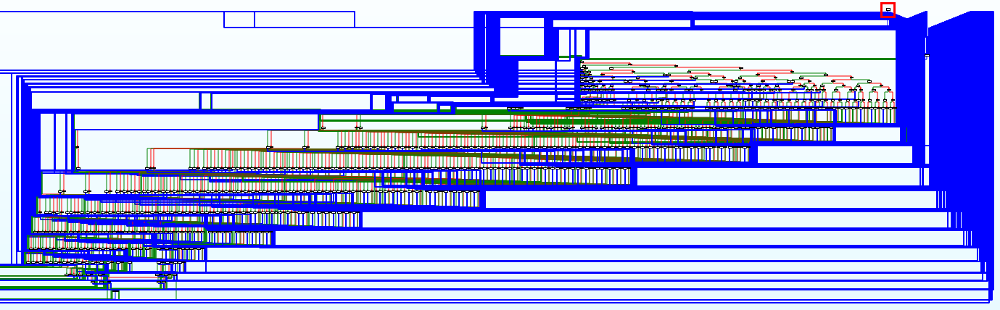

# 2017 BugsBunny - [REV] Rev400

## Key words

- ELF Reversing

## Solution

문제를 보면 프로그램의 입력이 2가지 함수를 통과 하면 플래그를 얻을 수 있습니다.

```c
int __cdecl main(int argc, const char **argv, const char **envp)
{
  int result; // eax@2
  const char *v4; // rbx@3

  if ( argc == 2 )
  {
    v4 = argv[1];
    if ( (unsigned __int8)IsValid((char *)argv[1]) && (unsigned __int8)IsValidAgAin(v4) )
    {
      puts("GO GO GO , This is your flag.");
      result = 1;
    }
    else
    {
      puts("Sorry ,Try Again .");
      result = 1;
    }
  }
  else
  {
    puts("./program <string>");
    result = 0;
  }
  return result;
}
```

그런데 문제는 `IsValid`의 함수안의 내용이 너무 복잡하고 길어서 먼저 `IsValidAgAin`을 살펴 보도록 합니다.

`IsValidAgAin` 함수는 특이하게 입력의 몇몇 부분만 검사를 하는데 검사 하는 부분은 다음과 같습니다. 이 함수를 통해 입력의 길이가 28 임을 알수 있습니다.

```
Index: 0123456789012345678901234567 
Value: H    1111              44 
```

이제 `IsValid`를 살펴 보아야 합니다.



저기 빨간 네모가 진입 지점 입니다. ^^;;;;;;;;;;;;;;;;;;;;;;;;;;;;;

한 번 따라 가보도록 하겠습니다.

```
gdb-peda$ x/30i IsValid
=> 0x400ff0 <IsValid>:  mov    eax,0x4dc7551e
   0x400ff5 <IsValid+5>:    nop    DWORD PTR [rax]
   0x400ff8 <IsValid+8>:    movzx  edx,BYTE PTR [rdi]
   0x400ffb <IsValid+11>:   test   dl,dl
   0x400ffd <IsValid+13>:   je     0x401820 <IsValid+2096>
   0x401003 <IsValid+19>:   cmp    eax,0x7de41f6c
   0x401008 <IsValid+24>:   je     0x402640 <IsValid+5712>
   0x40100e <IsValid+30>:   ja     0x4010a0 <IsValid+176>
   0x401014 <IsValid+36>:   cmp    eax,0x45d1c044
```

처음에 `eax`에 `0x4dc7551e`를 넣습니다. 여러 조건을 건너 뛰다가 이 조건을 맞는 분기문으로 들어 가면 다음과 같은 내용이 나옵니다.

```
=> 0x402274 <IsValid+4740>: cmp    dl,0x48
   0x402277 <IsValid+4743>: je     0x402b37 <IsValid+6983>
```

현재 `dl`은 `argv[0]` 이기 때문에 `set $dl=0x48`을 해주고 계속 넘어 가봅니다.

```
=> 0x402b37 <IsValid+6983>: mov    eax,0x2c5928f3
   0x402b3c <IsValid+6988>: jmp    0x400ff8 <IsValid+8>
```

```
=> 0x4021b0 <IsValid+4544>: cmp    dl,0x65
   0x4021b3 <IsValid+4547>: je     0x402aff <IsValid+6927>
```

현재 `dl`은 `argv[1]` 이기 때문에 `set $dl=0x65`를 하여 넘어 갑니다.

CFG는 어마어마 했지만 실제로 디버깅을 하면서 넘어 가보니 쉽게 쉽게 넘어 가집니다. 한 가지 주의 할점은 `IsValidAgAin`에서 얻은 문자열은 여기서는 체크를 하지 않고 그냥 넘어 가기 때문에 이 부분만 조심히 디버깅을 하다 보면 전체 답을 얻을 수 있습니다.

## Result

```
# Index           0123456789012345678901234567
# IsValid         Here-    -Is-My-5EcreT-  -HH
# IsValidAgAin         1111              44
# Flag            Here-1111-Is-My-5EcreT-44-HH

tbkim@ubuntu:~/ctfing/2017_bugsbunny/rev$ ./rev400 Here-1111-Is-My-5EcreT-44-HH
GO GO GO , This is your flag.
```
