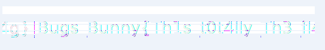

# 2017 BugsBunny - [REV] Rev75

## Key words

- Linux commands : strings, grep, head, base64

## Solution

바이너리를 살펴 보면 다음과 같습니다.

```c
int __cdecl main(int argc, const char **argv, const char **envp)
{
  const char *v3; // rsi@2
  int v4; // eax@2
  int result; // eax@6
  __int64 v6; // rbx@6
  __int64 v7; // [sp+20h] [bp-130h]@1
  int v8; // [sp+28h] [bp-128h]@1
  __int16 v9; // [sp+2Ch] [bp-124h]@1
  char v10; // [sp+2Eh] [bp-122h]@1
  char v11; // [sp+30h] [bp-120h]@1
  __int64 v12; // [sp+50h] [bp-100h]@1
  __int64 v13; // [sp+58h] [bp-F8h]@1
  __int64 v14; // [sp+60h] [bp-F0h]@1
  char v15; // [sp+68h] [bp-E8h]@1
  __int64 v16; // [sp+70h] [bp-E0h]@1
  __int64 v17; // [sp+78h] [bp-D8h]@1
  __int64 v18; // [sp+80h] [bp-D0h]@1
  int v19; // [sp+88h] [bp-C8h]@1
  __int16 v20; // [sp+8Ch] [bp-C4h]@1
  char v21; // [sp+90h] [bp-C0h]@1
  __int64 v22; // [sp+B0h] [bp-A0h]@1
  __int64 v23; // [sp+B8h] [bp-98h]@1
  __int64 v24; // [sp+C0h] [bp-90h]@1
  __int64 v25; // [sp+C8h] [bp-88h]@1
  __int64 v26; // [sp+D0h] [bp-80h]@1
  char v27; // [sp+E0h] [bp-70h]@1
  char v28; // [sp+110h] [bp-40h]@1
  __int64 v29; // [sp+138h] [bp-18h]@1

  v29 = *MK_FP(__FS__, 40LL);
  v7 = 'dr0wss4p';                              // p4ssw0rd
  v8 = 0;
  v9 = 0;
  v10 = 0;
  v22 = 'tub doog';                             // good but
  v23 = 'galf on ';                             // no flag
  v24 = 'uoy rof ';                             // for you
  v25 = ' ihihih ';
  v26 = 'Dx';                                   // xD
  v12 = 'ssap dab';                             // bad pass
  v13 = 'drow';                                 // word
  v14 = 0LL;
  v15 = 0;
  v16 = '. :egasu';                             // usage: ./rev75 password
  v17 = 'p 57ver/';
  v18 = 'drowssa';
  v19 = 0;
  v20 = 0;
  memcpy(&v28, &v22, 35LL);
  memcpy(&v27, &v12, 13LL);
  memcpy(&v11, &v7, 9LL);
  memcpy(&v21, &v16, 24LL);
  if ( argc <= 1 )
  {
    puts(&v21);
  }
  else
  {
    v3 = argv[1];
    sub_400330();
    if ( v4 )
      puts(&v27);                               // bad passwored
    else
      puts(&v28);
  }
  result = 0;
  v6 = *MK_FP(__FS__, 40LL) ^ v29;
  return result;
}
```

프로그램 입력으로 `p4ssw0rd`를 검사 하는데 `good but no flag for you hihihi XD` 만 뜨고 별다른 플래그가 뜨질 않습니다. 

그래서 다른 부분에 로직이 있는지 FLAG를 출력 할 수 있는게 있는지 검사하려고 Strings를 살펴 보았더니 다음과 같은 형태의 문자열이 바이너리에 존재하고 있습니다.

```
iVBORw0KGgoA
AAANSUhEUgAA
AoAAAAGQCAYA
AAA+89ElAAAA
BmJLR0QA/wD/
AP+gvaeTAAAA
CXBIWXMAAAsT
AAALEwEAmpwY
AAAAB3RJTUUH
4QcPFScXuHT4
+AAAABl0RVh0
Q29tbWVudABD
cmVhdGVkIHdp
dGggR0lNUFeB
DhcAABwOSURB
VHja7d19kFVl
4cDxZ5dlEUxx
ERBRQAlIQAhf
KFHRUUQzETNR
GY0kR9QMpanM
t8yfTpnomGJO
```

이는 `base64` 형태인데 첫 번째 부분만 디코딩 해보니 `png` 해더가 나왔습니다. 

따라서 이 부분에 존재하는 인코딩된 스트링을 모두 가져와 `base64`로 디코딩 했더니 플래그 `png`가 나타낫습니다.

```
strings rev75 | grep '^[a-zA-Z0-9+\/=]\{12\}$' | head -n -4 | base64 -d > flag.png
```

## Result

> Bugs_Bunny{Th1s_t0t4lly_Th3_fl4g}


잘 안나와서 따로 캡처 한 모습은 다음과 같습니다.

