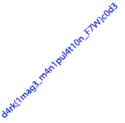

# 2017 HackCon - [Stegano] White

## Key words

- PNG (IEND+4)
- Base64

## Solution

문제에서 `final.png`를 제공해주는데 아무 내용이 없고 파일 크기가 너무 큽니다.

헥스 에딧으로 png의 끝인 `IEND+4` 쪽을 살펴 보니 `base64` 형태의 값이 들어 있어 이를 추출했습니다. 추출된 값 역시 `png`형태에 `IEND+4`에 `base64` 형태로 값이 들어 있었습니다.

`base64`가 없을때까지 추출하여 모든 png파일을 모아 플래그를 찾을 수 있습니다.

## Solution Code 

```python
data = open("dump.bin", "r").read().decode("base64")

for i in range(0, 50):
    open("dmup_%02d.png"%(i), "wb").write(data)
    data = data.split("IEND")[1][4:].decode("base64")
    idx = data.index("IEND")

    if len(data) >= idx+8:
        continue

    open("dmup_%02d.png"%(i), "wb").write(data)
    break

# d4rk{1mag3_m4n1pul4t10n_F7W}c0d3
```

## Result

