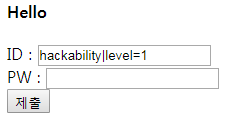

# 2017 Inc0gnito - [WEB] corneria

## Key words

- php reversing

## Solution

문제에 난독화된 php 코드를 제공해줍니다.

```php
<?php
define("FLAG", "flag{????????????}");
class info
{
    var $_;
    public function __get($name)
    {
        return $this->$name;
    }
    function ______($____)
    {
        $_ = array_reverse(explode("|", $____));
        foreach ($_ as $__) {
            $___ = explode("=", $__);
            if ($___[0] === 'id')
                $this->_['id'] = $___[1];
            else if ($___[0] === 'level')
                $this->_['authLevel'] = (int) $___[1];
            else if ($___[0] === 'pw') {
                $this->_['pw'] = $___[1];
            }
        }
    }
    function _____()
    {
        return $this->_['pw'];
    }
    function ___()
    {
        return $this->_['id'];
    }
    function ____()
    {
        return $this->_['authLevel'];
    }
    public function __construct()
    {
        $this->_['id']        = "default";
        $this->_['authLevel'] = (int) 0;
        $this->_['pw']        = md5("default_passwd");
    }
    function __($a)
    {
        $_ = rand(0, getrandmax());
        $_ = md5((string) $_ . $a);
        return $_;
    }
}
$i = new info;
if (isset($_POST['id']) && isset($_POST['pw'])) {
    $__   = true;
    $___  = md5($_POST['pw']);
    $____ = $_POST['id'];
    if (($___) === "is_this_really_md5?") {
        $_____ = 1;
    } else {
        $_____ = 0;
    }
    $______          = array();
    $______['id']    = "id=" . $____;
    $______['level'] = "level=" . $_____;
    $______['pw']    = "pw=" . $i->__($___);
    $_______         = implode("|", $______);
    $i->______($_______);
    if ($i->____() === 1) {
        echo FLAG;
    }
} else {
    $__ = false;
}
?>
<html><head><title>My auth site</title></head><body><h4>Hello <?php
if ($__)
    echo ", " . $i->___();
?></h4><?php
if ($__) {
    echo "Your ID : " . $i->___() . "<br>Your Level : " . $i->____() . "<br>Your password : " . $i->_____() . "<br>";
} else {
    echo "<form method='post' action='" . $_SERVER['PHP_SELF'] . "'>ID : <input type = 'text' name='id' /><br>PW : <input type = 'password' name='pw' /><br><input type='submit' /></form>";
}
?></body></html>
```

.... 보기 쉽게 좀 바꿔보도록 하겠습니다.

```php
<?php
define("FLAG", "flag{????????????}");
class info
{
    var $m_info;
    public function __get($name)
    {
        return $this->$name;
    }
    function parse_args($arg)
    {
        $explode_arr = array_reverse(explode("|", $arg));
        foreach ($explode_arr as $kv) {
            $arr_kv = explode("=", $kv);
            if ($arr_kv[0] === 'id')
                $this->m_info['id'] = $arr_kv[1];
            else if ($arr_kv[0] === 'level')
                $this->m_info['authLevel'] = (int) $arr_kv[1];
            else if ($arr_kv[0] === 'pw') {
                $this->m_info['pw'] = $arr_kv[1];
            }
        }
    }
    function get_pw()
    {
        return $this->m_info['pw'];
    }
    function get_id()
    {
        return $this->m_info['id'];
    }
    function get_level()
    {
        return $this->m_info['authLevel'];
    }
    public function __construct()
    {
        $this->m_info['id']        = "default";
        $this->m_info['authLevel'] = (int) 0;
        $this->m_info['pw']        = md5("default_passwd");
    }
    function ret_rnd($a)
    {
        $_ = rand(0, getrandmax());
        $_ = md5((string) $_ . $a);
        return $_;
    }
}
$i = new info;
if (isset($_POST['id']) && isset($_POST['pw'])) {
    $ret   = true;
    $pw_md5  = md5($_POST['pw']);
    $id = $_POST['id'];
    if (($pw_md5) === "is_this_really_md5?") {
        $level = 1;
    } else {
        $level = 0;
    }
    $new_arr          = array();
    $new_arr['id']    = "id=" . $id;
    $new_arr['level'] = "level=" . $level;
    $new_arr['pw']    = "pw=" . $i->ret_rnd($pw_md5);
    $imp_arr         = implode("|", $new_arr);
    $i->parse_args($imp_arr);
    if ($i->get_level() === 1) {
        echo FLAG;
    }
} else {
    $ret = false;
}
?>
<html><head><title>My auth site</title></head><body><h4>Hello <?php
if ($ret)
    echo ", " . $i->get_id();
?></h4><?php
if ($ret) {
    echo "Your ID : " . $i->get_id() . "<br>Your Level : " . $i->get_level() . "<br>Your password : " . $i->get_pw() . "<br>";
} else {
    echo "<form method='post' action='" . $_SERVER['PHP_SELF'] . "'>ID : <input type = 'text' name='id' /><br>PW : <input type = 'password' name='pw' /><br><input type='submit' /></form>";
}
?></body></html>
```

내용을 보면 `id`와 `pw`를 입력 받고 `level`이 1이 되면 플래그를 출력해줍니다. 그런데 `level`이 1이 되기 위해서 `md5`의 값이 이상한 스트링이 나와야 하는데 정상적인 형태는 아닙니다. 

이부분은 넘기고 `info` 클래스의 `parse_args`부분을 살펴 보면 `|`를 기준으로 배열을 나누고 값을 다시 넣습니다.

`php`에서 `implode`와 `explode`는 합치기, 나누기와 같습니다.

```
test['id'] = 'id=hackability'
test['pw'] = 'pw=1234'

implode("|", test)
[1] -> 'id=hackability|pw=1234'

explode('|', [1])
-> ['id=hackability', 'pw=1234']
```

의문점은 `|` 라는 문자열로 오브젝트를 구분하는 것이 너무 간단해 보입니다. `parse_arg`쪽에서 배열을 리버스 햇기 때문에 결과적으론 `pw={pw}|level=0|id={id}` 형태로 되어 `id`가 가장 마지막에 연산이 됩니다. 

아아디어는 `{id}`의 값을 `hackability|level=1` 로 넣게 된다면 `parse_args`에서 마지막 `level`을 다시 해석하여 1로 만들고 플래그를 출력하게 됩니다.

## result



```
INC0{just_consider_it_done}
Hello , hackability

Your ID : hackability
Your Level : 1
Your password : 6512bd43d9caa6e02c990b0a82652dca
```
