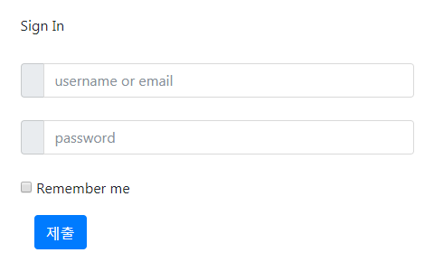

# 2017 HackCon - [WEB] Magic

## Key words

- Cookie header
- Brain Fuck Language

## Solution

페이지에 접속하면 로그인 화면이 뜹니다.



`SQLi`를 시도를 위해 python requests 모듈을 이용하여 페이지를 본 결과 다음과 같은 에러 메시지가 뜹니다.

```
requests.exceptions.ConnectionError: ('Connection aborted.', HTTPException('got more than 100 headers',))
```

해더가 100개가 넘어 에러가 발생한 것 같습니다. 이를 위해 `httplib`의 해더수 제한을 풀어 주면 됩니다.

```
import httplib
httplib._MAXHEADERS = 1000
```

해더를 보면 'set-cookie' 쪽에 `0`, `1` 과 같은 키가 존재 합니다.

```
'set-cookie': '0=%2B; expires=Thu, 01-Jan-1970 00:00:10 GMT; Max-Age=0; path=/, 1=%2B; expires=Thu, 01-Jan-1970 00:00:10 GMT; Max-Age=0; path=/, 2=%2B ...
```

이를 모아 보면 다음과 같이 `brainfuck` 형태의 값이 나오게 됩니다.

```
++++++++++[>+>+++>+++++++>++++++++++<<<<-]>>>>+++++++++++++++++.--.--------------.+++++++++++++.----.-------------.++++++++++++.--------.<------------.<++.>>----.+.<+++++++++++.+++++++++++++.>+++++++++++++++++.---------------.++++.+++++++++++++++.<<.>>-------.<+++++++++++++++.>+++..++++.--------.+++.<+++.<++++++++++++++++++++++++++.<++++++++++++++++++++++.>++++++++++++++..>+.----.>------.+++++++.--------.<+++.>++++++++++++..-------.++./
```

이를 [BrainFuck Interpreter](https://copy.sh/brainfuck/) 사이트를 통해 해석하면 다음과 같이 아이디와 비밀번호가 나옵니다.

```
username: abERsdhw password: HHealskdwwpr
```

이를 이용하여 처음에 로그인을 하면 플래그가 나오게 됩니다.

## Solution Code 

```python
import requests
import httplib
httplib._MAXHEADERS = 1000

url = "http://defcon.org.in:6060/index.php"

r = requests.get(url)
# requests.exceptions.ConnectionError: ('Connection aborted.', HTTPException('got more than 100 headers',))

print r.headers
data = r.headers['set-cookie'].split(";")

i = 0
res = ""
while i < len(data):
    tmp = data[i]
    if ", " in tmp:
        tmp = tmp.split(", ")[1]

    ch = tmp.split("=")[1]
    if len(ch) != 1:
        ch = ch[1:]
        ch = chr(int(ch, 16))

    res += ch
    i += 3

# ++++++++++[>+>+++>+++++++>++++++++++<<<<-]>>>>+++++++++++++++++.--.--------------.+++++++++++++.----.-------------.++++++++++++.--------.<------------.<++.>>----.+.<+++++++++++.+++++++++++++.>+++++++++++++++++.---------------.++++.+++++++++++++++.<<.>>-------.<+++++++++++++++.>+++..++++.--------.+++.<+++.<++++++++++++++++++++++++++.<++++++++++++++++++++++.>++++++++++++++..>+.----.>------.+++++++.--------.<+++.>++++++++++++..-------.++./
print res

# username: abERsdhw password: HHealskdwwpr
# d4rk{c00k13s_4r3_fun}c0de
```
